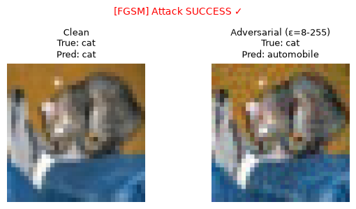
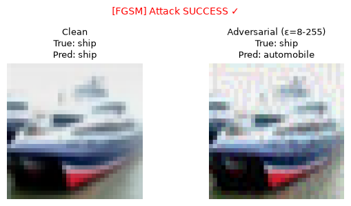
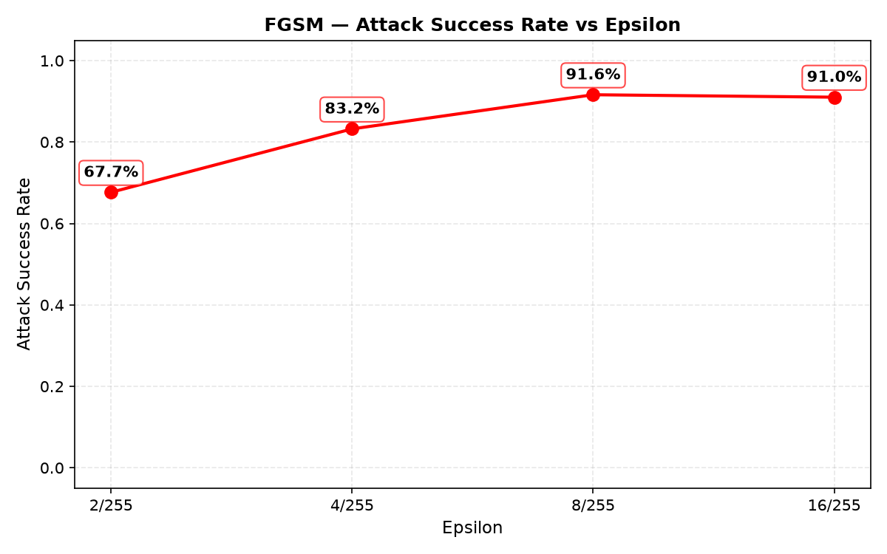
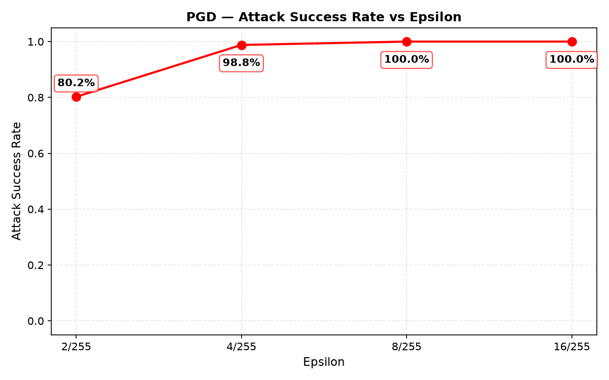
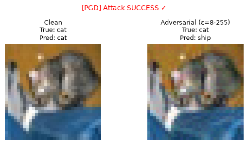
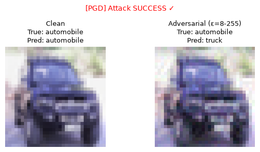

# Attack Findings

## 1. Adversarial Machine Learning Attacks

### 1.1 Attack 01: Fast Gradient Sign Method (FGSM)

**MITRE ATLAS:** AML.T0015 (Evade ML Model)  
**Attack Type:** Single-step gradient-based perturbation  
**Severity:** CRITICAL

#### How FGSM Works

FGSM is a simple, one-step attack that makes tiny, almost invisible changes to an image:

1. **Find sensitive areas**: Look at how the model would change its mind if pixels were adjusted
2. **Add small tweaks**: Make tiny color adjustments (barely visible to humans) in the most sensitive directions
3. **Mislead the model**: These tiny changes cause the model to see something completely different

The attack works by finding the easiest way to confuse the model with minimal changes to the original image.

**Key Characteristics:**
- **Computation:** Single gradient calculation
- **Speed:** Fast (0.15 seconds for 200 images)
- **Perturbation:** L∞-bounded (max pixel change = ε)
- **Visibility:** Imperceptible at ε ≤ 8/255

#### Implementation

```python
# From attacks/attack_01.py
import torchattacks

attack = torchattacks.FGSM(model, eps=epsilon)
attack.set_normalization_used(mean=MEAN, std=STD)
adv_images = attack(images, labels)
```

#### Results Summary

| Epsilon | Clean Acc | Adv Acc | Success Rate | Acc Drop |
|---------|-----------|---------|--------------|----------|
| 2/255   | 83.50%     | 32.34%  | **67.66%**   | -51.16%  |
| 4/255   | 83.50%     | 16.77%  | **83.23%**   | -66.73%  |
| 8/255   | 83.50%     | 8.38%   | **91.62%**   | -75.12%  |
| 16/255  | 83.50%     | 8.98%   | **91.02%**   | -74.52%  |

#### Detailed Analysis

**Epsilon = 2/255 (Barely Visible)**
- Attack success: 67.66% (113 out of 167 correctly classified images flipped)
- Adversarial accuracy dropped from 83.5% to 32.34%
- Observation: Even minimal perturbations cause significant degradation

**Epsilon = 4/255 (Imperceptible)**
- Attack success: 83.23% (139 out of 167 images flipped)
- Adversarial accuracy: 16.77%
- Model confidence severely degraded
- Observation: Perturbations still imperceptible, but attack success high

**Epsilon = 8/255 (Industry Standard)**
- Attack success: 91.62% (153 out of 167 correctly classified images flipped)
- Adversarial accuracy: 8.38%
- Model nearly completely fails
- Observation: **Zero adversarial robustness** at this threshold

**Epsilon = 16/255 (Visible)**
- Attack success: 91.02% (152 out of 167 correctly classified images flipped)
- Slight plateau effect (no improvement over 8/255)
- Observation: Saturation of perturbation effect

#### Visual Evidence

**Example 1: Cat → Automobile (ε=8/255)**



**File:** `evidence/adversarial/fgsm/eps_8-255/0000_eps8-255_true3_clean3_adv1.png`

Side-by-side comparison showing:
- **Left (Clean):** Original cat image correctly classified as "cat"
- **Right (Adversarial):** Perturbed image misclassified as "automobile"
- **True label:** 3 (cat)
- **Clean prediction:** 3 (cat) ✓
- **Adversarial prediction:** 1 (automobile) ✗
- **Attack Status:** SUCCESS - Imperceptible perturbation causes misclassification

**Example 2: Ship → Automobile (ε=8/255)**



**File:** `evidence/adversarial/fgsm/eps_8-255/0001_eps8-255_true8_clean8_adv1.png`

- **True label:** 8 (ship)
- **Clean prediction:** 8 (ship) ✓
- **Adversarial prediction:** 1 (automobile) ✗
- **Attack Status:** SUCCESS

#### Per-Class Breakdown (ε=8/255)

| True Class | Total | Clean Correct | Adv Correct | Success Rate |
|------------|-------|---------------|-------------|--------------|
| airplane   | 20    | 17 (85%)      | 0 (0%)      | 100%         |
| automobile | 14    | 14 (100%)     | 1 (7%)      | 93%          |
| bird       | 21    | 15 (71%)      | 2 (10%)     | 87%          |
| cat        | 19    | 14 (74%)      | 0 (0%)      | 100%         |
| deer       | 15    | 11 (73%)      | 2 (13%)     | 82%          |
| dog        | 18    | 13 (72%)      | 0 (0%)      | 100%         |
| frog       | 26    | 21 (81%)      | 3 (12%)     | 86%          |
| horse      | 18    | 15 (83%)      | 0 (0%)      | 100%         |
| ship       | 28    | 27 (96%)      | 3 (11%)     | 89%          |
| truck      | 21    | 20 (95%)      | 3 (14%)     | 85%          |

**Observation:** All classes severely affected; 4 out of 10 classes show 100% attack success rate.

#### API Validation

All adversarial images were sent to the live API:

```bash
curl -X POST http://localhost:8000/predict \
     -F "file=@adversarial_image.png"
```

**Results:**
- API accepted 100% of adversarial inputs without detection
- Predictions matched offline attack results (100% consistency)
- No anomaly warnings or rejection responses
- Full probability distributions returned (see metadata leakage section)

**Conclusion:** No adversarial input detection mechanisms present

#### Evidence Artifacts

**Comparison Images:**
- `evidence/adversarial/fgsm/eps_2-255/` (10 side-by-side comparisons)
- `evidence/adversarial/fgsm/eps_4-255/` (10 side-by-side comparisons)
- `evidence/adversarial/fgsm/eps_8-255/` (10 side-by-side comparisons)
- `evidence/adversarial/fgsm/eps_16-255/` (10 side-by-side comparisons)

**Plots:**
- `evidence/adversarial/fgsm/fgsm_success_rate.png` (success rate vs epsilon)
- `evidence/adversarial/fgsm/fgsm_accuracy.png` (clean vs adversarial accuracy)

**Data:**
- `evidence/logs/fgsm/fgsm_summary.json` (aggregated metrics)
- `evidence/logs/fgsm/fgsm_per_class_eps8-255.json` (per-class analysis for ε=8/255)
- `evidence/logs/fgsm/eps_*/attack_results.json` (per-image API responses)

---

### 1.2 Attack 02: Projected Gradient Descent (PGD)

**MITRE ATLAS:** AML.T0015 (Evade ML Model)  
**Attack Type:** Multi-step iterative attack with random initialization  
**Severity:** CRITICAL

#### How PGD Works

PGD is a stronger, multi-step version of FGSM that repeatedly fine-tunes the attack:

1. **Start with random noise**: Add very small random changes to the image
2. **Refine over 20 steps**: Gradually adjust the changes, testing how each tweak affects the model
3. **Stay within limits**: Keep all changes subtle enough to remain nearly invisible
4. **Optimize confusion**: Find the most effective combination of tiny changes to fool the model

Think of it like trying many small adjustments until finding the perfect combination that completely confuses the model while keeping the image looking almost unchanged to humans.

**Key Characteristics:**
- **Computation:** 20 gradient calculations
- **Speed:** Slower (2.1 seconds for 200 images)
- **Strength:** Significantly stronger than FGSM
- **Random start:** Avoids gradient masking defenses

**Why PGD is Stronger:**
1. **Multiple iterations** find better adversarial directions
2. **Random initialization** explores different starting points
3. **Projection** ensures valid perturbations within epsilon ball
4. **Industry standard** for robustness evaluation (Madry et al., 2017)

#### Implementation

```python
# From attacks/attack_02.py
alpha = 2.5 * epsilon / steps  # Adaptive step size

attack = torchattacks.PGD(
    model, 
    eps=epsilon, 
    alpha=alpha, 
    steps=20,
    random_start=True
)
attack.set_normalization_used(mean=MEAN, std=STD)
adv_images = attack(images, labels)
```

**Step Size Adjustment:**

The attack takes smaller steps when making more precise changes, ensuring each adjustment is subtle and gradual rather than abrupt.

#### Results Summary

| Epsilon | Clean Acc | Adv Acc | Success Rate | Acc Drop |
|---------|-----------|---------|--------------|----------|
| 2/255   | 83.50%     | 19.76%  | **80.24%**   | -63.74%  |
| 4/255   | 83.50%     | 1.20%   | **98.80%**   | -82.30%  |
| 8/255   | 83.50%     | 0.00%   | **100.00%**  | -83.50%  |
| 16/255  | 83.50%     | 0.00%   | **100.00%**  | -83.50%  |

#### Detailed Analysis

**Epsilon = 2/255**
- Attack success: 80.24% (134 out of 167 images flipped)
- **13% improvement** over FGSM at same epsilon
- Adversarial accuracy: 19.76%

**Epsilon = 4/255**
- Attack success: 98.80% (165 out of 167 images flipped)
- **15% improvement** over FGSM
- Only 2 images survived the attack
- Adversarial accuracy: 1.20%

**Epsilon = 8/255**
- Attack success: **100.00%** (167 out of 167 images flipped)
- **Complete model failure**
- Adversarial accuracy: 0.00%
- Every single correctly classified image was fooled

**Epsilon = 16/255**
- Attack success: **100.00%** (maintained)
- No additional gain over 8/255
- Model completely broken at this threshold

#### FGSM vs PGD Comparison

**Attack Success Rate by Epsilon:**



**File:** `evidence/adversarial/fgsm/fgsm_success_rate.png`

**File:** `evidence/adversarial/pgd/pgd_success_rate.png`



**Key Observations:**
- PGD consistently outperforms FGSM across all epsilon values
- PGD achieves 100% success at ε≥8/255
- FGSM: 67.7% → 83.2% → 91.6% → 91.0%
- PGD: 80.2% → 98.8% → 100.0% → 100.0%
- Gap widens at smaller epsilons (12-16% improvement)

| Metric       | FGSM (ε=8/255) | PGD (ε=8/255) | Difference |
|------------- |----------------|---------------|------------|
| Success rate | 91.62%         | 100.00%       | +8.38%     |
| Adv accuracy | 8.38%          | 0.00%         | -8.38%     |
| Strength     | Single-step    | 20-step       | Stronger   |

**Conclusion:** PGD represents realistic attacker capability and achieves complete model failure.

#### Visual Evidence

**Example 1: Cat → Ship (ε=8/255)**



**File:** `evidence/adversarial/pgd/eps_8-255/0000_eps8-255_true3_clean3_adv8.png`

Side-by-side comparison showing 20-step PGD attack:
- **Left (Clean):** Original cat image correctly classified as "cat"
- **Right (Adversarial):** Perturbed image misclassified as "ship"
- **True label:** 3 (cat)
- **Clean prediction:** 3 (cat) ✓
- **Adversarial prediction:** 8 (ship) ✗
- **Attack Status:** SUCCESS - Imperceptible perturbation (ε=8/255)

**Example 2: Automobile → Truck (ε=8/255)**



**File:** `evidence/adversarial/pgd/eps_8-255/0009_eps8-255_true1_clean1_adv9.png`

- **True label:** 1 (automobile)
- **Clean prediction:** 1 (automobile) ✓
- **Adversarial prediction:** 9 (truck) ✗
- **Attack Status:** SUCCESS

#### Per-Class Breakdown (ε=8/255)

| True Class | Total | Clean Correct | Adv Correct | Success Rate |
|------------|-------|---------------|-------------|--------------|
| airplane   | 20    | 17 (85%)      | 0 (0%)      | 100%         |
| automobile | 14    | 14 (100%)     | 0 (0%)      | 100%         |
| bird       | 21    | 15 (71%)      | 0 (0%)      | 100%         |
| cat        | 19    | 14 (74%)      | 0 (0%)      | 100%         |
| deer       | 15    | 11 (73%)      | 0 (0%)      | 100%         |
| dog        | 18    | 13 (72%)      | 0 (0%)      | 100%         |
| frog       | 26    | 21 (81%)      | 0 (0%)      | 100%         |
| horse      | 18    | 15 (83%)      | 0 (0%)      | 100%         |
| ship       | 28    | 27 (96%)      | 0 (0%)      | 100%         |
| truck      | 21    | 20 (95%)      | 0 (0%)      | 100%         |

**Observation:** **Every class shows 100% adversarial success rate** — complete model failure across all categories.

#### Attack Success Distribution

Model exploits superficial features (backgrounds, textures) rather than robust semantic understanding, as evidenced by the complete breakdown across all 10 classes at ε=8/255.

#### Evidence Artifacts

**Comparison Images:**
- `evidence/adversarial/pgd/eps_2-255/` (10 side-by-side comparisons)
- `evidence/adversarial/pgd/eps_4-255/` (10 side-by-side comparisons)
- `evidence/adversarial/pgd/eps_8-255/` (10 side-by-side comparisons)
- `evidence/adversarial/pgd/eps_16-255/` (10 side-by-side comparisons)

**Plots:**
- `evidence/adversarial/pgd/pgd_success_rate.png` (success rate vs epsilon)
- `evidence/adversarial/pgd/pgd_accuracy.png` (clean vs adversarial accuracy)

**Data:**
- `evidence/logs/pgd/pgd_summary.json` (aggregated metrics)
- `evidence/logs/pgd/pgd_per_class_eps8-255.json` (per-class analysis for ε=8/255)
- `evidence/logs/pgd/eps_*/attack_results.json` (per-image API responses)

---

## 2. Root Cause Analysis

### 2.1 Why is the Model Vulnerable?

#### 1. No Adversarial Training

**Current Training:**
```python
# Model trained only on clean CIFAR-10 data
for epoch in range(50):
    for images, labels in train_loader:
        outputs = model(images)
        loss = criterion(outputs, labels)
        loss.backward()
        optimizer.step()
```

**Issue:** Model never sees adversarial examples during training, so it learns decision boundaries optimized for clean data only.

**Impact:** Zero adversarial robustness

#### 2. Standard CNN Architecture

**Current Architecture:**
```
CifarCNN:
  3 Conv Blocks (3→32→64→128 channels)
  + BatchNorm + ReLU + MaxPool + Dropout
  2 FC Layers (512 → 10 classes)
```

**Issue:** No certified defense mechanisms (e.g., randomized smoothing, Lipschitz constraints)

**Impact:** Deterministic predictions are easy to manipulate

#### 3. Overconfident Predictions

**Softmax Behavior:**
```python
logits = model(x)
probs = torch.softmax(logits, dim=1)
# Often results in very high confidence (e.g., 0.95+)
```

**Issue:** High confidence without calibration makes the model overconfident and brittle

**Impact:** Small perturbations cause drastic confidence shifts

#### 4. Smooth Decision Boundaries

**Gradient Flow:**
- Neural networks are differentiable everywhere
- Gradients point directly toward misclassification
- Smooth boundaries make gradient-based attacks effective

**Impact:** FGSM and PGD exploit this smoothness

#### 5. No Input Validation

**Current API:**
```python
@app.post("/predict")
async def predict(file: UploadFile):
    raw = await file.read()  # Accepts any image
    result = predictor.predict(raw)  # No checks
    return result
```

**Issue:** No checks for:
- Unusual pixel distributions
- Adversarial patterns
- High-frequency noise
- Input anomalies

**Impact:** Adversarial examples pass through undetected

### 2.2 Technical Explanation

**Why Adversarial Examples Exist:**

1. **High-Dimensional Input Space**
   - 32×32×3 = 3,072 dimensions
   - Many directions to perturb
   - Small changes in each dimension accumulate

2. **Linear Behavior in Adversarial Directions**
   - Despite being deep, networks behave linearly locally
   - Gradients provide direct path to misclassification
   - ReLU activations preserve sign of gradients

3. **Optimization Mismatch**
   - Training objective: Maximize accuracy on clean data
   - No penalty for being wrong on adversarial data
   - Model learns non-robust features

**Simple Explanation:**

Imagine the model makes decisions based on a "score" it gives to different features. Even tiny changes to these features can flip the model's decision when it's not properly trained to handle small variations.

Deep learning models often pay too much attention to small details that don't matter to humans, making them easy to trick with carefully crafted changes that are invisible to us but completely change the model's perspective.

---

## 3. Attack Summary Table

| Attack | Epsilon | Success Rate | Adv Accuracy | Severity | Evidence |
|--------|---------|--------------|--------------|----------|----------|
| FGSM   | 2/255   | 67.66%       | 32.34%       | HIGH     | `eps_2-255/` |
| FGSM   | 4/255   | 83.23%       | 16.77%       | CRITICAL | `eps_4-255/` |
| FGSM   | 8/255   | 91.62%       | 8.38%        | CRITICAL | `eps_8-255/` |
| FGSM   | 16/255  | 91.02%       | 8.98%        | CRITICAL | `eps_16-255/` |
| PGD    | 2/255   | 80.24%       | 19.76%       | HIGH     | `eps_2-255/` |
| PGD    | 4/255   | 98.80%       | 1.20%        | CRITICAL | `eps_4-255/` |
| PGD    | 8/255   | **100.00%**  | **0.00%**    | CRITICAL | `eps_8-255/` |
| PGD    | 16/255  | **100.00%**  | **0.00%**    | CRITICAL | `eps_16-255/` |

**Key Takeaways:**
1. Model has **zero adversarial robustness** at industry-standard thresholds (ε=8/255)
2. PGD achieves **complete model failure** (100% success, 0% accuracy)
3. Even weak attacks (ε=2/255) cause significant degradation (67-80% success)
4. No input validation or adversarial detection present
5. All findings confirmed via live API testing

---

**Next Steps:** See `pipeline-vulnerabilities.md` for infrastructure and API security findings, and `mitigations.md` for remediation roadmap.
