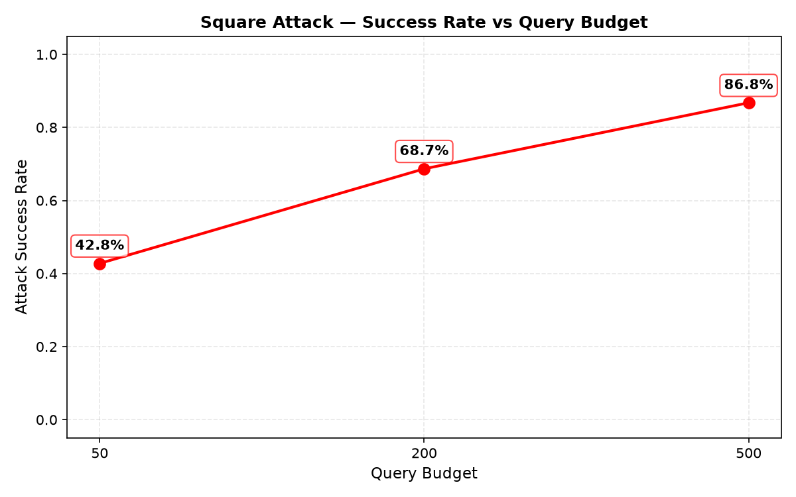
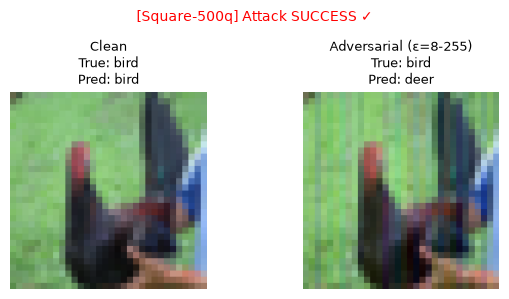
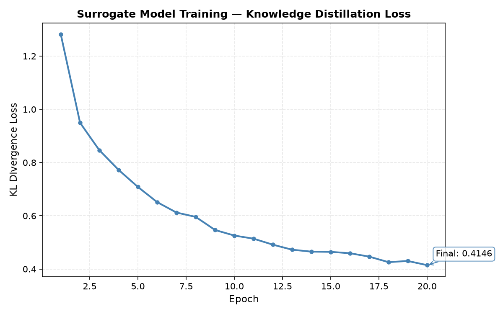
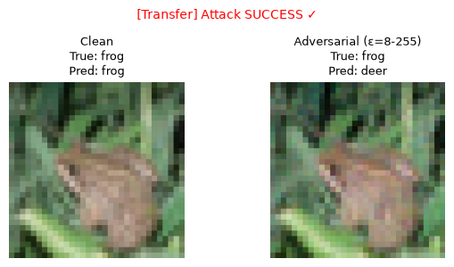

# Attack Findings

## 1. Adversarial Machine Learning Attacks

### 1.1 Attack 01: Fast Gradient Sign Method (FGSM)

**MITRE ATLAS:** AML.T0043 (Craft Adversarial Data) → AML.T0015 (Evade AI Model)  
**Attack Type:** Single-step gradient-based perturbation  
**Severity:** HIGH (92% success at imperceptible perturbations; requires white-box access)

#### How FGSM Works

FGSM is a simple, one-step attack that makes tiny, almost invisible changes to an image:

1. **Find sensitive areas**: Look at how the model would change its mind if pixels were adjusted
2. **Add small tweaks**: Make tiny color adjustments (barely visible to humans) in the most sensitive directions
3. **Mislead the model**: Make a very small change that causes the model's prediction to change.

The attack finds a direction in which a small change to the input most increases the model's error, then applies a small perturbation in that direction..

**Key Characteristics:**
- **Computation:** Single gradient calculation
- **Speed:** Fast ( 28 seconds for 200 images)
- **Perturbation:** L∞-bounded (max pixel change = ε)
- **Visibility:** Imperceptible at ε ≤ 8/255

#### Implementation

```python
# From attacks/attack_01.py
import torchattacks

attack = torchattacks.FGSM(model, eps=epsilon)
attack.set_normalization_used(mean=MEAN, std=STD)
adv_images = attack(images, labels)
```

#### Results Summary

| Epsilon | Clean Acc | Adv Acc | Success Rate | Acc Drop |
|---------|-----------|---------|--------------|----------|
| 2/255   | 83.50%     | 32.34%  | **67.66%**   | -51.16%  |
| 4/255   | 83.50%     | 16.77%  | **83.23%**   | -66.73%  |
| 8/255   | 83.50%     | 8.38%   | **91.62%**   | -75.12%  |
| 16/255  | 83.50%     | 8.98%   | **91.02%**   | -74.52%  |

#### Detailed Analysis

**Epsilon = 2/255 (Barely Visible)**
- Attack success: 67.66% (113 out of 167 correctly classified images flipped)
- Adversarial accuracy dropped from 83.5% to 32.34%
- Observation: Even minimal perturbations cause significant degradation

**Epsilon = 4/255 (Imperceptible)**
- Attack success: 83.23% (139 out of 167 images flipped)
- Adversarial accuracy: 16.77%
- Model confidence severely degraded
- Observation: Perturbations still imperceptible, but attack success high

**Epsilon = 8/255 (Industry Standard)**
- Attack success: 91.62% (153 out of 167 correctly classified images flipped)
- Adversarial accuracy: 8.38%
- Model nearly completely fails
- Observation: **Zero adversarial robustness** at this threshold

**Epsilon = 16/255 (Visible)**
- Attack success: 91.02% (152 out of 167 correctly classified images flipped)
- Slight plateau effect (no improvement over 8/255)
- Observation: Saturation of perturbation effect

#### Visual Evidence

**Example 1: Cat → Automobile (ε=8/255)**


**File:** `evidence/adversarial/fgsm/eps_8-255/0000_eps8-255_true3_clean3_adv1.png`

Side-by-side comparison showing:
- **Left (Clean):** Original cat image correctly classified as "cat"
- **Right (Adversarial):** Perturbed image misclassified as "automobile"
- **True label:** 3 (cat)
- **Clean prediction:** 3 (cat) ✓
- **Adversarial prediction:** 1 (automobile) ✗
- **Attack Status:** SUCCESS - Imperceptible perturbation causes misclassification


#### Per-Class Breakdown (ε=8/255)

| True Class | Total | Clean Correct | Adv Correct | Success Rate |
|------------|-------|---------------|-------------|--------------|
| airplane   | 20    | 17 (85%)      | 0 (0%)      | 100%         |
| automobile | 14    | 14 (100%)     | 1 (7%)      | 93%          |
| bird       | 21    | 15 (71%)      | 2 (10%)     | 87%          |
| cat        | 19    | 14 (74%)      | 0 (0%)      | 100%         |
| deer       | 15    | 11 (73%)      | 2 (13%)     | 82%          |
| dog        | 18    | 13 (72%)      | 0 (0%)      | 100%         |
| frog       | 26    | 21 (81%)      | 3 (12%)     | 86%          |
| horse      | 18    | 15 (83%)      | 0 (0%)      | 100%         |
| ship       | 28    | 27 (96%)      | 3 (11%)     | 89%          |
| truck      | 21    | 20 (95%)      | 3 (14%)     | 85%          |

**Observation:** All classes severely affected; 4 out of 10 classes show 100% attack success rate.

#### API Validation

All adversarial images were sent to the live API:

```bash
curl -X POST http://localhost:8000/predict \
     -F "file=@attacks/samples/adversarial_image.png"
```

**Results:**
- API accepted 100% of adversarial inputs without detection
- No anomaly warnings or rejection responses
- Full probability distributions returned

**Note:** Clean prediction consistency is addressed in Section 1.3.

**Conclusion:** No adversarial input detection mechanisms present.

#### Evidence Artifacts

**Comparison Images:**
- `evidence/adversarial/fgsm/eps_2-255/` (10 side-by-side comparisons)
- `evidence/adversarial/fgsm/eps_4-255/` (10 side-by-side comparisons)
- `evidence/adversarial/fgsm/eps_8-255/` (10 side-by-side comparisons)
- `evidence/adversarial/fgsm/eps_16-255/` (10 side-by-side comparisons)

**Plots:**
- `evidence/adversarial/fgsm/fgsm_success_rate.png` (success rate vs epsilon)
- `evidence/adversarial/fgsm/fgsm_accuracy.png` (clean vs adversarial accuracy)

**Data:**
- `evidence/logs/fgsm/fgsm_summary.json` (aggregated metrics)
- `evidence/logs/fgsm/fgsm_per_class_eps8-255.json` (per-class analysis for ε=8/255)
- `evidence/logs/fgsm/eps_*/attack_results.json` (per-image API responses)

---

### 1.2 Attack 02: Projected Gradient Descent (PGD)

**MITRE ATLAS:** AML.T0043 (Craft Adversarial Data) → AML.T0015 (Evade AI Model)  
**Attack Type:** Multi-step iterative attack with random initialization  
**Severity:** CRITICAL (100% success at industry-standard threshold; white-box but demonstrates complete model failure)

#### How PGD Works

PGD is a stronger, multi-step version of FGSM that repeatedly fine-tunes the attack:

1. **Start with random noise**: Add very small random changes to the image
2. **Refine over 20 steps**: Gradually adjust the changes, testing how each tweak affects the model
3. **Stay within limits**: Keep all changes subtle enough to remain nearly invisible
4. **Optimize confusion**: Find the most effective combination of tiny changes to fool the model


**Key Characteristics:**
- **Computation:** 20 gradient calculations
- **Speed:** Slower (1.06 minute for 200 images)
- **Strength:** Significantly stronger than FGSM
- **Deterministic start:** Uses fixed seed (42) for reproducible results

**Why PGD is Stronger:**
1. **Multiple iterations** find better adversarial directions
2. **Projection** ensures valid perturbations within epsilon ball
3. **Industry standard** for robustness evaluation (Madry et al., 2017)

#### Implementation

```python
# From attacks/attack_02.py
alpha = 2.5 * epsilon / steps  # Madry et al. (2017) heuristic

attack = torchattacks.PGD(
    model, 
    eps=epsilon, 
    alpha=alpha, 
    steps=20,
    random_start=True
)
attack.set_normalization_used(mean=MEAN, std=STD)
adv_images = attack(images, labels)
```

**Step Size:** The Madry-style heuristic `alpha = 2.5 * epsilon / steps` scales the per-step perturbation to be proportional to the total epsilon budget and inversely proportional to the number of iterations. This ensures consistent attack strength across different epsilon values while using multiple refinement steps.

#### Results Summary

| Epsilon | Clean Acc | Adv Acc | Success Rate | Acc Drop |
|---------|-----------|---------|--------------|----------|
| 2/255   | 83.50%     | 19.76%  | **80.24%**   | -63.74%  |
| 4/255   | 83.50%     | 1.20%   | **98.80%**   | -82.30%  |
| 8/255   | 83.50%     | 0.00%   | **100.00%**  | -83.50%  |
| 16/255  | 83.50%     | 0.00%   | **100.00%**  | -83.50%  |

#### Detailed Analysis

**Epsilon = 2/255**
- Attack success: 80.24% (134 out of 167 images flipped)
- **13% improvement** over FGSM at same epsilon
- Adversarial accuracy: 19.76%

**Epsilon = 4/255**
- Attack success: 98.80% (165 out of 167 images flipped)
- **15% improvement** over FGSM
- Only 2 images survived the attack
- Adversarial accuracy: 1.20%

**Epsilon = 8/255**
- Attack success: **100.00%** (167 out of 167 images flipped)
- **Complete model failure**
- Adversarial accuracy: 0.00%
- Every single correctly classified image was fooled

**Epsilon = 16/255**
- Attack success: **100.00%** (maintained)
- No additional gain over 8/255
- Model completely broken at this threshold

#### FGSM vs PGD Comparison

**Attack Success Rate by Epsilon:**


**File:** `evidence/adversarial/fgsm/fgsm_success_rate.png`

**File:** `evidence/adversarial/pgd/pgd_success_rate.png`


**Key Observations:**
- PGD consistently outperforms FGSM across all epsilon values
- PGD achieves 100% success at ε≥8/255
- FGSM: 67.7% → 83.2% → 91.6% → 91.0%
- PGD: 80.2% → 98.8% → 100.0% → 100.0%
- Performance gap largest at intermediate epsilons

| Metric       | FGSM (ε=8/255) | PGD (ε=8/255) | Difference |
|------------- |----------------|---------------|------------|
| Success rate | 91.62%         | 100.00%       | +8.38 pts  |
| Adv accuracy | 8.38%          | 0.00%         | -8.38 pts  |
| Strength     | Single-step    | 20-step       | Stronger   |

**Gap Analysis Across Epsilons:**
- ε=2/255: 12.6 percentage point gap (FGSM 67.7% vs PGD 80.2%)
- ε=4/255: 15.6 percentage point gap (FGSM 83.2% vs PGD 98.8%)
- ε=8/255: 8.4 percentage point gap (FGSM 91.6% vs PGD 100.0%)

**Observation:** PGD's advantage peaks at moderate epsilons (4/255) where both methods remain below saturation, then narrows at ε=8/255 as FGSM already achieves near-complete success.

**Conclusion:** PGD represents realistic attacker capability and achieves complete model failure.

#### Visual Evidence

**Example 1: Cat → Ship (ε=8/255)**


**File:** `evidence/adversarial/pgd/eps_8-255/0000_eps8-255_true3_clean3_adv8.png`

Side-by-side comparison showing 20-step PGD attack:
- **Left (Clean):** Original cat image correctly classified as "cat"
- **Right (Adversarial):** Perturbed image misclassified as "ship"
- **True label:** 3 (cat)
- **Clean prediction:** 3 (cat) ✓
- **Adversarial prediction:** 8 (ship) ✗
- **Attack Status:** SUCCESS - Imperceptible perturbation (ε=8/255)


#### Per-Class Breakdown (ε=8/255)

| True Class | Total | Clean Correct | Adv Correct | Success Rate |
|------------|-------|---------------|-------------|--------------|
| airplane   | 20    | 17 (85%)      | 0 (0%)      | 100%         |
| automobile | 14    | 14 (100%)     | 0 (0%)      | 100%         |
| bird       | 21    | 15 (71%)      | 0 (0%)      | 100%         |
| cat        | 19    | 14 (74%)      | 0 (0%)      | 100%         |
| deer       | 15    | 11 (73%)      | 0 (0%)      | 100%         |
| dog        | 18    | 13 (72%)      | 0 (0%)      | 100%         |
| frog       | 26    | 21 (81%)      | 0 (0%)      | 100%         |
| horse      | 18    | 15 (83%)      | 0 (0%)      | 100%         |
| ship       | 28    | 27 (96%)      | 0 (0%)      | 100%         |
| truck      | 21    | 20 (95%)      | 0 (0%)      | 100%         |

**Observation:** **Every class shows 100% adversarial success rate** — complete model failure across all categories.

#### Attack Success Distribution

Model exploits superficial features (backgrounds, textures) rather than robust semantic understanding, as evidenced by the complete breakdown across all 10 classes at ε=8/255.

#### Evidence Artifacts

**Comparison Images:**
- `evidence/adversarial/pgd/eps_2-255/` (10 side-by-side comparisons)
- `evidence/adversarial/pgd/eps_4-255/` (10 side-by-side comparisons)
- `evidence/adversarial/pgd/eps_8-255/` (10 side-by-side comparisons)
- `evidence/adversarial/pgd/eps_16-255/` (10 side-by-side comparisons)

**Plots:**
- `evidence/adversarial/pgd/pgd_success_rate.png` (success rate vs epsilon)
- `evidence/adversarial/pgd/pgd_accuracy.png` (clean vs adversarial accuracy)

**Data:**
- `evidence/logs/pgd/pgd_summary.json` (aggregated metrics)
- `evidence/logs/pgd/pgd_per_class_eps8-255.json` (per-class analysis for ε=8/255)
- `evidence/logs/pgd/eps_*/attack_results.json` (per-image API responses)

---

### 1.3 Clean Prediction Inconsistency: Offline vs API

**Finding:** 1-image discrepancy between offline model (167 correct) and API (166 correct) on clean inputs. This image is correctly classified offline but misclassified by the API, revealing a **model deployment issue** (likely floating-point precision, normalization, or serialization difference).

**Impact on Results:**
- FGSM/PGD use 167 images (offline-only testing)
- Square Attack uses 166 images (API queries reveal the mismatch)
- Model Extraction and Transfer inherit the 166-image set

---

### 1.4 Attack 03: Square Attack (Black-box Query-based)

**MITRE ATLAS:** AML.T0040 (AI Model Inference API Access) → AML.T0043 (Craft Adversarial Data) → AML.T0015 (Evade AI Model)  
**Attack Type:** Score-based black-box optimization via random search  
**Severity:** CRITICAL (87% success with realistic API-only access; no gradient requirement)

#### How Square Attack Works

Square Attack is a black-box method that finds adversarial examples using only model predictions—no access to model internals:

1. **Query-only access:** Send images to API, observe predictions
2. **Square perturbations:** Try random square-shaped patches of noise on the image
   (seeded at 42 for reproducible results)
3. **Greedy selection:** Keep changes that worsen the correct class score
4. **Adaptive refinement:** Focus on most promising regions, shrink square size over iterations

Unlike FGSM and PGD which require model gradients, Square Attack works with only input-output queries—realistic for attacking deployed APIs.

**Key Characteristics:**
- **No gradients needed:** Pure black-box via API queries
- **Query budget:** 50-500 queries per image tested
- **Random search:** Importance sampling of perturbation regions


#### Implementation

```python
# From attacks/attack_03.py
class APIModelWrapper(torch.nn.Module):
    def forward(self, images):
        # Query API for each image
        response = send_to_api(images[i], url=API_URL)
        probs = response["probabilities"]
        logits = torch.tensor([np.log(max(p, 1e-10)) for p in probs])
        return logits

attack = torchattacks.Square(
    model_wrapper, norm="Linf", eps=8/255,
    n_queries=query_budget, n_restarts=1,
    p_init=0.8, loss="margin", seed=42
)
adv_images = attack(images, labels)
```

#### Results Summary

| Query Budget | Success Rate | Avg Queries | Median Queries | Time | API Calls |
|--------------|--------------|-------------|----------------|------|-----------|
| 50           | 42.77%       | 12.5        | 7              | 58s  | 6,150     |
| 200          | 68.67%       | 42.1        | 14             | 148s | 15,495    |
| 500          | 86.75%       | 95.7        | 31             | 271s | 24,927    |

**Query Cost Breakdown:** Each attack per image includes initial clean prediction check + budget queries + final verification query = Budget + 5 overhead queries. Real-world cost: 50→55 queries/image, 200→205 queries/image, 500→505 queries/image.

#### Detailed Analysis

**Budget = 50 Queries**
- Success: 71 out of 166 images (42.77%)
- Average queries per success: 12.5
- Median: 7 (many succeed quickly)
- Total time: 58.1 seconds
- **Observation:** Even with minimal budget, 43% attack success

**Budget = 200 Queries**
- Success: 114 out of 166 images (68.67%)
- Average queries: 42.1
- Median: 14 (efficient search)
- Total time: 147.8 seconds
- **26% improvement** over 50-query budget

**Budget = 500 Queries**
- Success: 144 out of 166 images (86.75%)
- Average queries: 95.7
- Median: 31
- Total time: 270.6 seconds
- **87% success rate** — comparable to white-box FGSM

#### Key Findings

1. **Black-box attacks are practical:** 87% success with 500 queries per image
2. **Query efficiency:** Median of only 31 queries for successful attacks
3. **No gradient access required:** Works against any API returning predictions
4. **Realistic threat:** Attacker needs only HTTP access, not model internals
5. **Undetected:** API accepted all queries without rate limiting or anomaly detection

#### Query Budget vs Success Rate



**File:** `evidence/adversarial/square/square_success_rate.png`

**Observation:** Logarithmic improvement—most gain from 50→200

#### Visual Evidence

**Example 1: Bird → Deer (Budget=500, 5 queries)**



**File:** `evidence/adversarial/square/queries_500/0025_eps8-255_true2_clean2_adv4.png`

- **True label:** 2 (bird)
- **Clean prediction:** 2 (bird) ✓
- **Adversarial prediction:** 4 (deer) ✗
- **Queries used:** 5
- **Attack Status:** SUCCESS 


#### API Exposure Risk

**Total queries sent:** 46,572 across all budgets and 166 images.

**Query efficiency:** Most successful attacks require far fewer than the full budget:
- Budget 50: average 12.5 queries per successful attack (median 7)
- Budget 200: average 42.1 queries per successful attack (median 14)
- Budget 500: average 95.7 queries per successful attack (median 31)

This means the actual query load is dominated by failed attacks that exhaust the budget, not successful ones.

**No detection or mitigation observed:**
- No rate limiting enforced
- No CAPTCHA or verification challenges
- No anomalous query pattern alerts
- All responses included full 10-class probability distributions

**Conclusion:** API is completely exposed to query-based attacks without defensive monitoring.

#### Evidence Artifacts

**Comparison Images:**
- `evidence/adversarial/square/queries_50/` (10 successful examples)
- `evidence/adversarial/square/queries_200/` (10 successful examples)
- `evidence/adversarial/square/queries_500/` (10 successful examples)

**Plots:**
- `evidence/adversarial/square/square_success_rate.png`
- `evidence/adversarial/square/square_accuracy.png`

**Data:**
- `evidence/logs/square/square_summary.json`
- `evidence/logs/square/queries_*/attack_results.json`

---

### 1.5 Attack 04: Model Extraction via API Queries

**MITRE ATLAS:** AML.T0040 (AI Model Inference API Access) → AML.T0024.002 (Extract AI Model)  
**Related techniques:** AML.T0043 (Craft Adversarial Data) and AML.T0015 (Evade AI Model) in transfer phase  
**Attack Type:** Query-based model stealing with knowledge distillation  
**Severity:** CRITICAL (80% behavioral fidelity with realistic API-only access; IP theft + enables follow-on white-box attacks)

#### How Model Extraction Works

Model extraction (also called model stealing) replicates a victim model's behavior by querying it and training a surrogate:

1. **Query collection:** Send many images to the API, record predictions
2. **Knowledge distillation:** Train a different architecture using API responses as "soft labels"
3. **Surrogate evaluation:** Test if surrogate agrees with victim on new inputs
4. **Adversarial transfer:** Craft adversaries on surrogate, test if they transfer to victim

**Why This Matters:**
- Attacker steals intellectual property (trained model behavior) without accessing weights
- Surrogate enables white-box attacks (gradient access) against black-box victim
- Cheaper than training from scratch—leverages victim's data and compute

#### Implementation

```python
# From attacks/attack_04.py and attacks/model_extraction/

# Step 1: Collect 10,000 query-response pairs
query_data = collect_query_data(test_loader, API_URL, n_images=10000)

# Step 2: Train surrogate on victim's predictions (different architecture)
surrogate = RealisticSurrogate(num_classes=10)
surrogate, loss_history = train_surrogate(
    query_data, epochs=20, batch_size=128, lr=0.001
)

# Step 3: Evaluate agreement
agreement_rate = evaluate_agreement(surrogate, test_images, API_URL, n_samples=1000)

# Step 4: Test adversarial transferability
adv_images = craft_surrogate_adversarials(surrogate, images, labels, epsilon=8/255)
transfer_metrics = test_transferability(surrogate, adv_images, API_URL)
```

**Surrogate Architecture (Different from Victim):**
```
RealisticSurrogate:
  Conv1: 3→16 channels, kernel=5, BatchNorm, ReLU, MaxPool
  Conv2: 16→32 channels, kernel=5, BatchNorm, ReLU, MaxPool, Dropout(0.3)
  Conv3: 32→64 channels, kernel=3, BatchNorm, ReLU, AdaptiveAvgPool
  FC1: 256→128, BatchNorm, ReLU, Dropout(0.4)
  FC2: 128→10
```

**Why This Works:** Knowledge distillation doesn't require identical architecture—only that the surrogate learns the same decision boundaries. The victim's `/model/info` endpoint leaked input shape (3×32×32) and class count (10), enabling the attacker to build a compatible surrogate. 10,000 queries provided sufficient training data to achieve 80.3% agreement despite architectural differences.

#### Results Summary

| Metric | Value |
|--------|-------|
| Queries sent | 10,000 |
| Query time | 104.8 seconds |
| Query rate | 95.4 queries/second |
| Training epochs | 20 |
| Training time | 398.1 seconds |
| Final loss | 0.4146 |
| **Agreement rate** | **80.3%** |
| Transfer test size | 200 images (166 correctly classified) |
| Transfer attack type | PGD (ε=8/255, 20 steps) |
| **Transfer success rate** | **80.12%** (133/166) |
| Total attack time | 525.7 seconds (~8.8 minutes) |

#### Detailed Analysis

**Phase 1: Query Collection**
- 10,000 images queried in 104.8 seconds
- API throughput: 95.4 queries/second
- No rate limiting or query budget enforcement
- All responses included full probability distributions (enabling high-fidelity distillation)

**Phase 2: Surrogate Training**
- 20 epochs of knowledge distillation on victim predictions
- Final loss: 0.4146 (converged)
- Training time: 6.6 minutes
- Surrogate learned victim's decision boundaries despite architectural difference

**Phase 3: Agreement Evaluation**
- Tested on 1,000 held-out images
- **80.3% agreement:** Surrogate predicts same class as victim 80% of the time
- High fidelity replication of victim behavior

**Phase 4: Adversarial Transferability**
- Crafted PGD adversarials on surrogate (ε=8/255)
- Tested 166 correctly classified images against victim API
- **80.12% transfer success:** Adversarials crafted on surrogate fooled victim 80% of the time
- Proves surrogate captured victim's vulnerabilities

#### Key Findings

1. **Model theft is practical:** 10,000 queries sufficient to replicate 80% of model behavior
2. **No defense present:** API accepted unlimited queries without detection
3. **High-fidelity extraction:** 80% agreement with different architecture
4. **Transferable adversarials:** 80% of surrogate-crafted attacks succeed on victim
5. **Gradient access via surrogate:** Attacker gains white-box attack capability against black-box victim

#### Visual Evidence

**Training Convergence:**



**File:** `evidence/adversarial/model_extraction/training_loss.png`

Shows loss decreasing over 20 epochs—surrogate successfully learned from victim predictions.

**Transferred Adversarial Examples:**



**File:** `evidence/adversarial/model_extraction/0004_eps8-255_true6_clean6_adv4.png`

- **True label:** 6 (frog)
- **Surrogate clean prediction:** 6 (frog) ✓
- **Victim API adversarial prediction:** 4 (deer) ✗
- **Transfer status:** SUCCESS


#### Attack Cost Analysis

**Attacker investment:**
- Query cost: ~10,000 API calls (completed in under 2 minutes)
- Training cost: 7 minutes
- Total attack time: <10 minutes end-to-end

**Victim loss:**
- Intellectual property stolen (model behavior replicated at 80% fidelity)
- Attacker gains gradient access for future adversarial crafting
- Training investment (original model) effectively leaked via queries

**Conclusion:** Model extraction is cheap, fast, and undetected—critical vulnerability for proprietary ML services.

#### Evidence Artifacts

**Model Files:**
- `evidence/adversarial/model_extraction/surrogate_model.pth` (trained weights)
- `evidence/adversarial/model_extraction/training_loss.png` (convergence plot)

**Transfer Examples:**
- `evidence/adversarial/model_extraction/transfer_*.png` (10 side-by-side comparisons)

**Data:**
- `evidence/logs/model_extraction/extraction_summary.json` (all metrics)

---

## 2. Attack Comparison

### Severity Rubric

**CRITICAL:** Success ≥80% OR complete model failure (0% accuracy) OR realistic API-only access enabling practical attacks.

**HIGH:** Success 50-79% AND requires specialized access (white-box gradients) OR limited exploitability.

**MEDIUM:** Success <50% OR significant barriers to exploitation.

### Success Rate Summary

| Attack | Epsilon/Budget | Success Rate | Method | API Access |
|--------|----------------|--------------|--------|------------|
| FGSM   | 8/255          | 91.62%       | White-box | Yes (validation) |
| PGD    | 8/255          | **100.00%**  | White-box | Yes (validation) |
| Square | 500 queries    | 86.75%       | Black-box | **Only** |
| Extraction + Transfer | 10k queries + PGD | 80.12% | Black-box→White-box | **Only** |

**Key Insight:** Black-box attacks (Square, Extraction) achieve comparable success to white-box attacks, demonstrating that gradient access is not required for practical adversarial attacks.

### Threat Realism Ranking

1. **Most realistic:** Model Extraction + Transfer (pure API access, realistic attacker)
2. **Highly realistic:** Square Attack (query-based, no model access)
3. **Moderate realism:** PGD (assumes gradient access via stolen weights or insider threat)
4. **Baseline:** FGSM (weakest attack, still 91% success)

**Conclusion:** Even the most realistic black-box scenarios show critical vulnerabilities. The model is comprehensively broken across all threat models.

---

## 3. Root Cause Analysis

### Why is the Model Vulnerable?

#### 1. No Adversarial Training

**Current Training:**
```python
# Model trained only on clean CIFAR-10 data
for epoch in range(50):
    for images, labels in train_loader:
        outputs = model(images)
        loss = criterion(outputs, labels)
        loss.backward()
        optimizer.step()
```

**Issue:** Model never sees adversarial examples during training, so it learns decision boundaries optimized for clean data only.

**Impact:** Zero adversarial robustness

#### 2. Standard CNN Architecture

**Current Architecture:**
```
CifarCNN:
  3 Conv Blocks (3→32→64→128 channels)
  + BatchNorm + ReLU + MaxPool + Dropout
  2 FC Layers (512 → 10 classes)
```

**Issue:** No certified defense mechanisms (e.g., randomized smoothing, Lipschitz constraints)

**Impact:** Deterministic predictions are easy to manipulate

#### 3. Overconfident Predictions

**Softmax Behavior:**
```python
logits = model(x)
probs = torch.softmax(logits, dim=1)
# Often results in very high confidence (e.g., 0.95+)
```

**Issue:** High confidence without calibration makes the model overconfident and brittle

**Impact:** Small perturbations cause drastic confidence shifts

#### 4. Smooth Decision Boundaries

**Gradient Flow:**
- Neural networks are differentiable everywhere
- Gradients point directly toward misclassification
- Smooth boundaries make gradient-based attacks effective

**Impact:** FGSM and PGD exploit this smoothness

#### 5. No Input Validation

**Current API:**
```python
@app.post("/predict")
async def predict(file: UploadFile):
    raw = await file.read()  # Accepts any image
    result = predictor.predict(raw)  # No checks
    return result
```

**Issue:** No checks for:
- Unusual pixel distributions
- Adversarial patterns
- High-frequency noise
- Input anomalies

**Impact:** Adversarial examples pass through undetected

### Technical Explanation

**Why Adversarial Examples Exist:**

1. **High-Dimensional Input Space**
   - 32×32×3 = 3,072 dimensions
   - Many directions to perturb
   - Small changes in each dimension accumulate

2. **Linear Behavior in Adversarial Directions**
   - Despite being deep, networks behave linearly locally
   - Gradients provide direct path to misclassification
   - ReLU activations preserve sign of gradients

3. **Optimization Mismatch**
   - Training objective: Maximize accuracy on clean data
   - No penalty for being wrong on adversarial data
   - Model learns non-robust features

---

## 4. Summary Table

| Attack | Parameters | Success Rate | Adv Accuracy | Severity | Evidence Location |
|--------|------------|--------------|--------------|----------|-------------------|
| FGSM   | ε=2/255    | 67.66%       | 32.34%       | HIGH     | `evidence/adversarial/fgsm/eps_2-255/` |
| FGSM   | ε=4/255    | 83.23%       | 16.77%       | CRITICAL | `evidence/adversarial/fgsm/eps_4-255/` |
| FGSM   | ε=8/255    | 91.62%       | 8.38%        | CRITICAL | `evidence/adversarial/fgsm/eps_8-255/` |
| FGSM   | ε=16/255   | 91.02%       | 8.98%        | CRITICAL | `evidence/adversarial/fgsm/eps_16-255/` |
| PGD    | ε=2/255,   | 80.24% | 19.76%       | HIGH     | `evidence/adversarial/pgd/eps_2-255/` |
| PGD    | ε=4/255,   | 98.80% | 1.20%        | CRITICAL | `evidence/adversarial/pgd/eps_4-255/` |
| PGD    | ε=8/255,   | **100.00%** | **0.00%** | CRITICAL | `evidence/adversarial/pgd/eps_8-255/` |
| PGD    | ε=16/255,  | **100.00%** | **0.00%** | CRITICAL | `evidence/adversarial/pgd/eps_16-255/` |
| Square | 50 queries | 42.77%       | 57.23%       | HIGH     | `evidence/adversarial/square/queries_50/` |
| Square | 200 queries | 68.67%      | 31.33%       | CRITICAL | `evidence/adversarial/square/queries_200/` |
| Square | 500 queries | 86.75%      | 13.25%       | CRITICAL | `evidence/adversarial/square/queries_500/` |
| Extraction | 10k queries | 80.3% agreement | N/A   | CRITICAL | `evidence/adversarial/model_extraction/` |
| Transfer | PGD on surrogate | 80.12% | 19.88%  | CRITICAL | `evidence/adversarial/model_extraction/transfer_*/` |

**Key Takeaways:**
1. Model has **zero adversarial robustness** at industry-standard thresholds (ε=8/255)
2. PGD achieves **complete model failure** (100% success, 0% accuracy)
3. Black-box attacks (Square, Extraction) are practical and achieve 80-87% success
4. Model extraction enables gradient-based attacks on originally black-box victim
5. No input validation, rate limiting, or adversarial detection present

---

**Next:** See `pipeline-vulnerabilities.md` for infrastructure and API security findings, and `mitigations.md` for remediation roadmap.
